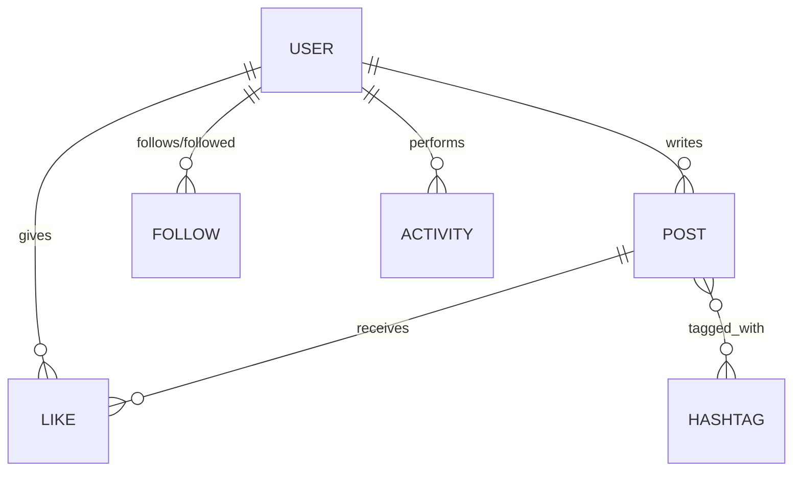

# Social Media Platform Backend Design

## Database Schema Design

The system is built using a relational database (SQLite) with the following core entities:

### Entities & Relationships

1.  **User**: Represents accounts on the platform.
    - One-to-Many with **Post** (author)
    - One-to-Many with **Like** (given)
    - One-to-Many with **Follow** (both as follower and followed)
    - One-to-Many with **Activity** (actor)

2.  **Post**: Contains user-generated content.
    - Many-to-One with **User** (author)
    - One-to-Many with **Like** (received)
    - Many-to-Many with **Hashtag** (tags used in content)

3.  **Hashtag**: Stores unique hashtag strings.
    - Many-to-Many with **Post**

4.  **Like**: Join table between **User** and **Post** for tracking likes.
    - Unique constraint on `[userId, postId]` to prevent duplicate likes.

5.  **Follow**: Join table between **User** and **User** for following relationships.
    - Unique constraint on `[followerId, followingId]` to prevent duplicate follows.

6.  **Activity**: Historical log of user actions (Posts, Likes, Follows, Unfollows).
    - Allows for chronological activity feed and auditing.

### ER Diagram

## Indexing Strategy

To ensure high performance, the following indexing strategy was implemented:

1.  **Unique Indexes**: 
    - `users.email`: Fast lookup and uniqueness of identity.
    - `likes.[userId, postId]`: Ensures data integrity and speeds up "Is liked" checks.
    - `follows.[followerId, followingId]`: Ensures data integrity and speeds up "Is following" checks.
    - `hashtags.tag`: Fast tag lookup and uniqueness.

2.  **Foreign Key Indexes**:
    - Automatically created indexes on `userId`, `postId`, `followerId`, `followingId` ensure fast joins and relation fetching.

3.  **Composite & Search Indexes**:
    - `post_hashtags.[postId, hashtagId]`: Optimized for Many-to-Many relationship traversal.
    - `activities.[userId, createdAt]`: Optimized for fetching latest user activity history.

## Scalability Considerations

1.  **Paginated Endpoints**: All list-returning endpoints (Feed, Followers, Hashtag search, Activity) implement `limit` and `offset` pagination to handle large datasets efficiently.
2.  **Read-write Separation**: As the platform grows, the Activity log can be moved to a high-speed write-heavy store (like Redis or a NoSQL solution) while keeping the core relational data in a traditional DB.
3.  **Efficient Joins**: By using TypeORM's `relations` and `queryBuilder`, we minimize N+1 query problems by fetching related data in optimized batches.
4.  **Hashtag Synchronization**: Hashtags are extracted and synchronized only on Post creation/update, minimizing runtime processing during search.

## Other Considerations

- **Soft vs Hard Delete**: Currently using hard deletes for simplicity, but for a production system, soft deletes (using `DeleteDateColumn`) would be preferred for data recovery.
- **Validation**: Strict validation is handled via Joi middleware to ensure data integrity before database operations.
